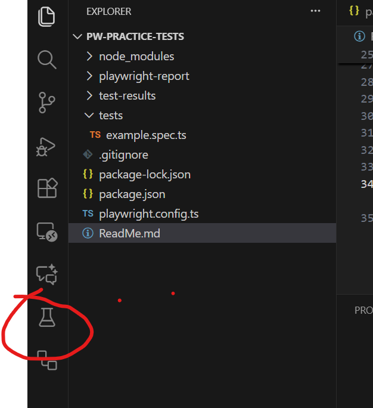

Run the application as pre-requists: For this projects we're building it from local application
Open PW-practice-app project and do the following..

https://playwright.dev/docs/getting-started-vscode
https://playwright.dev/docs/actionability
https://playwright.dev/docs/test-agents

//also check coursed for playwright with cucumber
//playwright api testing
//check for udemy courses which you learn: from Artem Bondar,Rahul Shetty
//also can check out for playwright AI usage , there are several courses for them in udemy

clone the application project using: https://github.com/bondar-artem/pw-practice-app.git
we will delete this project from my local since it's very big:: ~1 GB

1. npm install --force
   start the application..
2. npm start
   to open the application in browser type
3. localhost:4200

now for playwright tests::

1. install playwright using:
2. npm init playwright@latest
3. run the tests using npxplaywright test
4. to see report npx playwright show-report
5. to run a test on particular browser: npx playwright test --project=chromium
6. to run tests in headed mode.. npx playwright test --project=chromium --headed
7. to run one particular spec files instead of all present in 'test' folder:
   npx playwright test example.spec.ts --project=chromium --headed
8. to run a specific test instead of a test file..
   npx playwright test -g "has title" --project=chromium
9. to ignore a test from execution..
   in the 'spec' file , in the 'test' method.. add skip.... test.skip('hastitle' , async ({})=> {})
   now run the test with normal npx command
10. to run 'just 1' test from the complete test files.. use 'ony' after 'test' method of playwright
    test.only(...) .. now use the same command to run the test as before

---

running tests from VS code UI.. 11. go to 'Tests' in light side panel --> project, search, Git,Debug, extension, remote explorer, Tests, GithubActions.. From here click on Tests

very import commsnd to understand everything what a playwright test is doing..

12. npx playwright test --ui

--debug tests and trace view

12. npx playwright test --project=chromium --trace on

actually debug playwright tests.. we can start playwright tests with 'debug' command/flag

13. npx playwright test -project=chromium --trace on
14. another way to start the debug mode.. go to UI tests as mentioned in step 11.. but before that,
    put a debugger in the script (by clicking a line and it shows a red mark)
    now start the test from there in debug mode
15. also we can put a command in our script like , page.debug() and it will start th debug mode from there..

look at package.json --> script block..
basically we define all short scripts there and we can run them using npm run <script_name>
npm run pageObjects-chrome.....

running them in parallel ...
go to config.ts/js file and check for object 'worker'.. (max worker are 5)
//above means that 'each spec file' will run in parallel.. but each test()
under that spec file will be sequential..

anoter option for running in parallel. look for object. fullParallel: true/gfalse.
this will tell playwright to update setting for within the spec file parallel execution required. yes or no

ENV variable...
check the base URL in the config file..
also to load different ENV specific configurations , for example : dev, st, pre-prod etc.
we add them as a 'new project' in the config file:
checkout the config file (project section) for details:
cool ok, now lets say we need to call a URL which is different from base URL..
this is all is useful if we want to have a another custom variable and we want to use it within our config file and later within project block of config file..
rememember to extend : defineConfig<TestOptions>
first we create a file.. test-options.ts
so what it does is basically, it extends 'test' method from playwright and add additional options in there
whatever we define in TestOptions..
so in order to use it , we need to import {test} from '../test-Options' and not {test} from 'playwright/test'
..see the file: sample.spec.js... you will understand more of it..
combine it with config.js.. and also look into test-options.js..
also if we have certain things (piece of code) to be just run for a specific type of projects..
that can also be handled
for example , if we want to make sure , in my script, we do something else in dev ENV, like : click on something in my script (other than normal flow of the code) OR simply to get the value of which project we are running the test
against all of this is stored in 'testInfo' property..
look at the code sample.spec.js file..
Also, instead of Test-options , we can use 'process.ENV.Variable' too in order to store URL..
so, lets create a file .env
also, we can use js ternary operator to decide env variable.. look at config fiel again..

for video property if we want to store it:
we have to use command line always to run them otherwise they won't work..

playwright.config.ts: it has 2 sections in total: global section and project section
everything which is configured globally can be convered in the project setting as well
and can have different value for each project
and everything which is defined in project level, will override what is defined in overall
creating your wown playwright configuration file:
we can custom our own playwright config file.
let's say we give this a name as : playwright-prod.config.ts
have the detauls whatever in it we need..
the command is: (lets use npx as we have it defined ): npx playwright --config=playwright-prod.congig.ts..

fixtures: very important..
//look at the testWithFixture.spec.ts and also test-option.ts file.

sharing auth state, so that we don't have to manualy loginand do the work from UI
we can make API request. store the auth state locally and can share with other tests as well
so that they don't have to login at each step..

how to save a data in process.ENV and how to get it back:
it can be done using multi ways but one of such way is mentionedin 'auth.setup.ts' file.

look at the fixtures how we define them in 'js' way, it's inside folder: jsTestFixture -> testBase.js file
